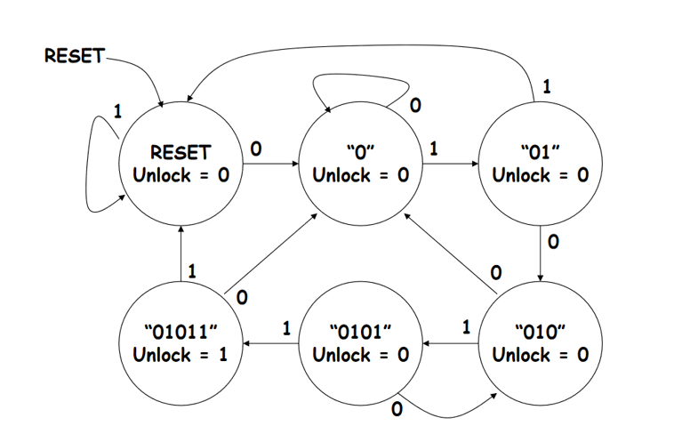

# Projects
## Traffic Signal
- The module has two input signals, a clock signal (clk) and a reset signal (reset), and four output signals (North, East, South, West) which are 3-bit vectors representing the states of the traffic lights.
- The module also has a 5-bit register (current) that keeps track of the current state of the traffic lights.
- Delay for green light 5ns and for red light 1ns.

**REFERENCE** - [Traffir Signal - EDA Playground](https://www.edaplayground.com/x/FX22)
