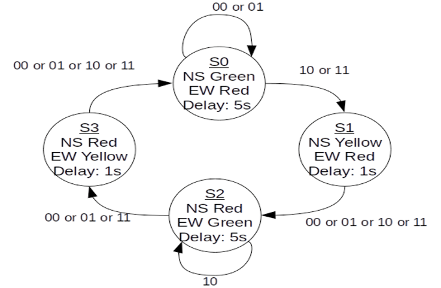
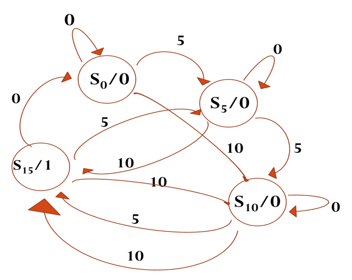

# Projects
## Traffic Signal
- The module has two input signals, a clock signal (clk) and a reset signal (reset), and four output signals (North, East, South, West) which are 3-bit vectors representing the states of the traffic lights.
- The module also has a 5-bit register (current) that keeps track of the current state of the traffic lights.
- Delay for green light 5ns and for red light 1ns.

**REFERENCE** - [Traffic Signal - EDA Playground](https://edaplayground.com/x/Rfv7)

## Vending Machine
- Design a vending machine that accepts only two coins, 5 rupee and 10 rupee. 
- The vending machine works by detecting the sequence of coin inputs and then outputting a can of coke when the total reaches 15 rupees. 

The design uses sequence detection and FSM to ensure that the vending machine only dispenses a can of coke when the correct sequence of coins is inputted. 
The machine is programmed to not return any residual coin if the total amount of rupees exceeds 15.

**REFERENCE** - [Vending Machine - EDA Playground](https://edaplayground.com/x/A2Kv)

## Electronic Lock
- Design an electronic combination lock using sequence detection and FSM. 
- The lock has a reset button, two number buttons (0 and 1), and an unlock output. 
- The combination to unlock the device is 01011.

The lock works by detecting the correct sequence of button presses and then outputting a signal to unlock the device. The FSM design ensures that the lock can only be unlocked with the correct combination.

**REFERENCE** - [Electronic Lock - EDA Playground](https://edaplayground.com/x/vDcn)
